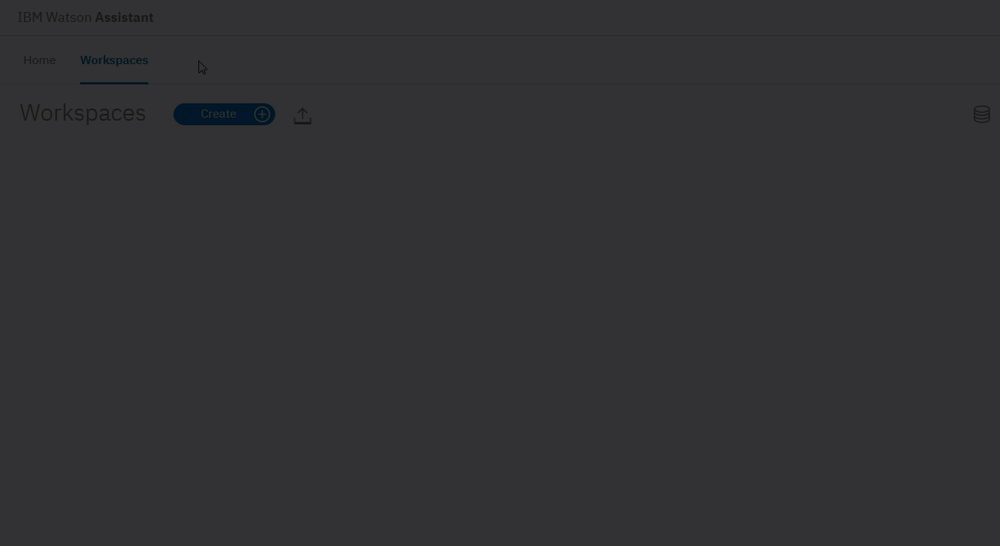
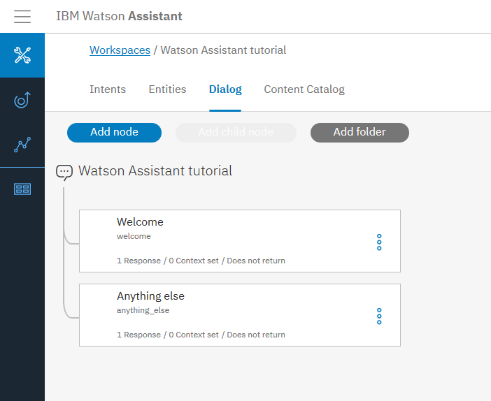
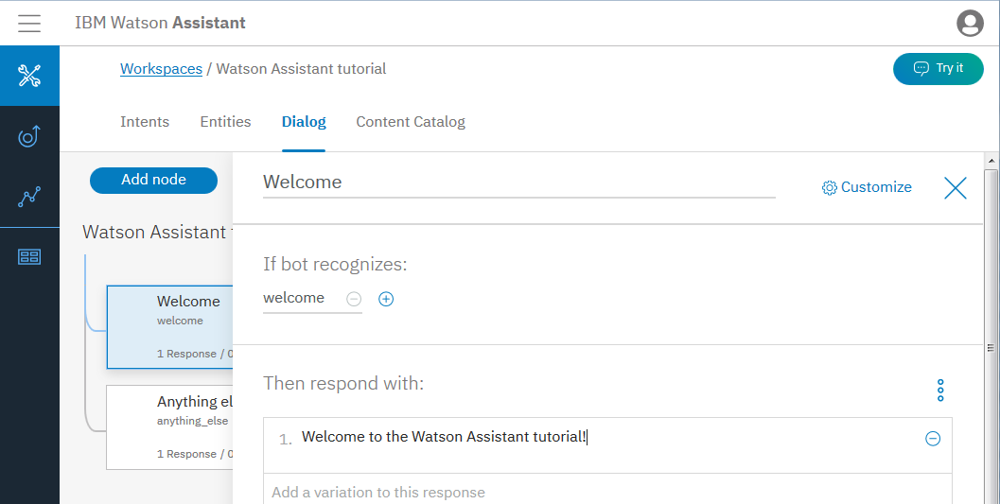
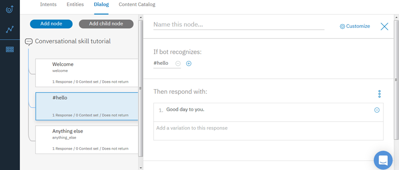
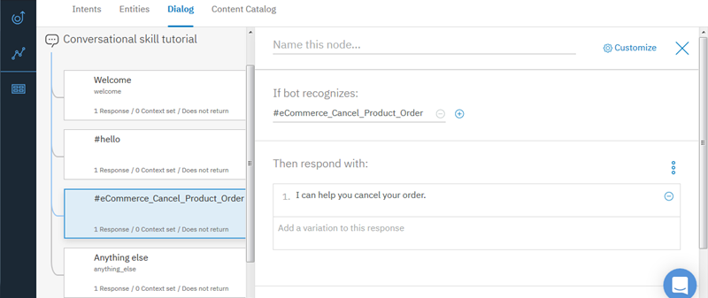
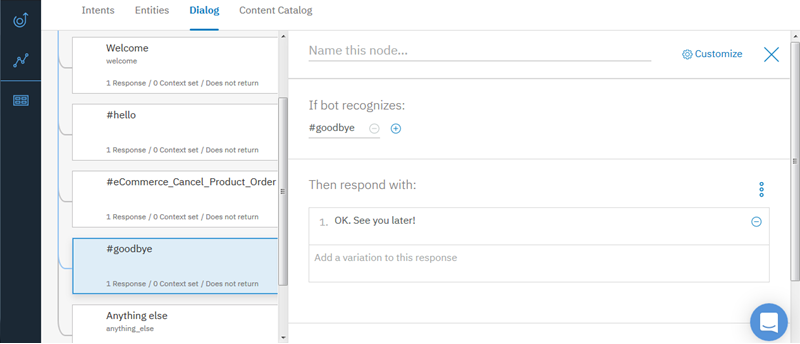

---

copyright:
  years: 2015, 2018
lastupdated: "2018-03-23"

---

{:shortdesc: .shortdesc}
{:new_window: target="_blank"}
{:tip: .tip}
{:pre: .pre}
{:codeblock: .codeblock}
{:screen: .screen}
{:javascript: .ph data-hd-programlang='javascript'}
{:java: .ph data-hd-programlang='java'}
{:python: .ph data-hd-programlang='python'}
{:swift: .ph data-hd-programlang='swift'}
{:download: .download}
{:gif: data-image-type='gif'}

# Getting started tutorial
{: #gettingstarted}

In this short tutorial, we introduce the {{site.data.keyword.conversationshort}} tool and go through the process of creating your first conversation.
{: shortdesc}

## Before you begin
{: #prerequisites}

You'll need a service instance to start.

<!-- Remove the text marked `download` after there's no g-s tab in the catalog dashboard -->

You created your service instance. Click **Manage**, then **Launch Tool**. Go to Step 2.
{: download tip}

If you created a project with the {{site.data.keyword.conversationshort}} service, you're all set with these prerequisites. Go to Step 1.

1.  Go to the {{site.data.keyword.watson}} Developer Console [Services ](https://console.{DomainName}/developer/watson/services){: new_window} page.
1.  Select {{site.data.keyword.conversationshort}}, click **Add Services**, and either sign up for a free {{site.data.keyword.Bluemix_notm}} account or log in.
1.  Change the project name to `watson-assistant-tutorial`, and then click **Create Project**.

<!-- Remove this text after dedicated instances have the developer console: begin -->

If you use {{site.data.keyword.Bluemix_dedicated_notm}}, create your service instance from the [{{site.data.keyword.conversationshort}} ](https://console.{DomainName}/catalog/services/conversation/){: new_window} page in the Catalog.

<!-- Remove this text after dedicated instances have the developer console: end -->

## Step 1: Launch the tool
{: #launch-tool}

After you create a project that includes the {{site.data.keyword.conversationshort}} service, you'll land on the project details page. Launch the  {{site.data.keyword.conversationshort}} tool from here.

Click **Launch Tool** for {{site.data.keyword.conversationshort}} under **Services**.

<!-- To do: Add screenshot for developer console -->

If you're prompted to log into the tool, provide your {{site.data.keyword.Bluemix_notm}} credentials.

If you're not at a project details page for the {{site.data.keyword.conversationshort}} service, go to the {{site.data.keyword.watson}} Developer Console [Projects ](https://console.{DomainName}/developer/watson/projects) page and select the project.
{: tip}

<!-- Remove this text after dedicated instances have the developer console: begin -->

{{site.data.keyword.Bluemix_dedicated_notm}}: Select your service instance from the Dashboard to launch the tooling.

<!-- Remove this text after dedicated instances have the Developer Console: end -->

## Step 2: Create a workspace
{: #create-workspace}

Your first step in the {{site.data.keyword.conversationshort}} tool is to create a workspace.

A [*workspace*](configure-workspace.html) is a container for the artifacts that define the conversation flow.

1.  In the {{site.data.keyword.conversationshort}} tool, click **Create**.
1.  Give your workspace the name `{{site.data.keyword.conversationshort}} tutorial`. If the dialog you plan to build will use a language other than English, then choose the appropriate language from the list. Click **Create**. Youʼll land on the **Intents** tab of your new workspace.

{: gif}

## Step 3: Create intents
{: #create-intents}

An [intent](intents.html) represents the purpose of a user's input. You can think of intents as the actions your users might want to perform with your application.

For this example, we're going to keep things simple and define only two intents: one for saying hello, and one for saying goodbye.

1.  Make sure you're on the Intents tab. (You should already be there, if you just created the workspace.)
1.  Click **Add intent**.
1.  Name the intent `hello`, and then click **Create intent**.
1.  Type `hello` into the **Add user example** field, and then press **Enter**.

   *Examples* tell the {{site.data.keyword.conversationshort}} service what kinds of user input you want to match to the intent. The more examples you provide, the more accurate the service can be at recognizing user intents.
1.  Add four more examples:
    - `good morning`
    - `greetings`
    - `hi`
    - `howdy`

1.  Click the **Close**  icon to finish creating the #hello intent.
1.  Create another intent named #goodbye with these five examples:
    - `bye`
    - `farewell`
    - `goodbye`
    - `I'm done`
    - `see you later`

You've created two intents, #hello and #goodbye, and provided example user input to train {{site.data.keyword.watson}} to recognize these intents in your users' input.

## Step 4: Add intents from a content catalog
{: #add-catalog}

Add training data that was built by IBM to your workspace by adding intents from a content catalog. In particular, you will give your assistant access to the `eCommerce` content catalog so your dialog can address user requests to complete common online transactions.

1.  In the {{site.data.keyword.conversationshort}} tool, click the **Content Catalog** tab.
1.  Find **eCommerce** in the list, and then click **Add to workspace**.
1.  Open the **Intents** tab to review the intents and associated example utterances that were added to your training data. You can recognize them because each intent name begins with the prefix `#eCommerce_`. You will add the `#eCommerce_Cancel_Product_Order` intent to your dialog in a later step.

You have successfully supplemented your training data with prebuilt content provided by IBM.

## Step 5: Build a dialog
{: #build-dialog}

A [dialog](dialog-build.html) defines the flow of your conversation in the form of a logic tree. Each node of the tree has a condition that triggers it, based on user input.

We'll create a simple dialog that handles our #hello and #goodbye intents, each with a single node.

### Adding a start node

1.  In the {{site.data.keyword.conversationshort}} tool, click the **Dialog** tab.
1.  Click **Create**. You'll see two nodes:
    - **Welcome**: Contains a greeting that is displayed to your users when they first engage with the bot.
    - **Anything else**: Contains phrases that are used to reply to users when their input is not recognized.

    
1.  Click the **Welcome** node to open it in the edit view.
1.  Replace the default response with the text, `Welcome to the {{site.data.keyword.conversationshort}} tutorial!`.

    
1.  Click  to close the edit view.

You created a dialog node that is triggered by the `welcome` condition, which is a special condition that indicates that the user has started a new conversation. Your node specifies that when a new conversation starts, the system should respond with the welcome message.

### Testing the start node

You can test your dialog at any time to verify the dialog. Let's test it now.

- Click the  icon to open the "Try it out" pane. You should see your welcome message.

    

### Adding nodes to handle intents

Now let's add nodes to handle our intents between the `Welcome` node and the `Anything else` node.

1.  Click the More icon  on the **Welcome** node, and then select **Add node below**.
1.  Type `#hello` in the **Enter a condition** field of this node. Then select the **#hello** option.
1.  Add the response, `Good day to you.`
1.  Click  to close the edit view.

   
1.  Click the More icon  on this node, and then select **Add node below** to create a peer node. In the peer node, specify `#eCommerce_Cancel_Product_Order` as the condition.
1.  Add the following text as the response.

    `I can help you cancel your order.`

    
1.  Click the More icon  on this node, and then select **Add node below** to create another peer node. In the peer node, specify `#goodbye` as the condition, and `OK. See you later!` as the response.

   

### Testing intent recognition

You  built a simple dialog to recognize and respond to both hello and goodbye inputs. Let's see how well it works.

1.  Click the  icon to open the "Try it out" pane. There's that reassuring welcome message.
1.  At the bottom of the pane, type `Hello` and press Enter. The output indicates that the #hello intent was recognized, and the appropriate response (`Good day to you.`) appears.
1.  Try the following input:
    - `bye`
    - `howdy`
    - `see ya`
    - `good morning`
    - `sayonara`

1.  Enter `I want to cancel an order I placed.` and press Enter. The output indicates that the `#eCommerce_Cancel_Product_Order` intent was recognized, and the response that you added for it is displayed.

  **Note**: In a dialog that is used by an assistant in production, you would likely add more child nodes that collect the order number and any other necessary information from the user, and then make a programmatic call to your order tracking backend service to cancel the order on the user's behalf.

  {: gif}

{{site.data.keyword.watson}} can recognize your intents even when your input doesn't exactly match the examples you included. The dialog uses intents to identify the purpose of the user's input regardless of the precise wording used, and then responds in the way you specify.

### Result of building a dialog

That's it. You created a simple conversation with three intents and a dialog to recognize them.

## Step 6: Review the sample workspace
{: #review-sample-workspace}

Open the sample workspace to see intents similar to the ones you just created plus many more, and see how they are used in a complex dialog.

1.  Go back to the Workspaces page.
   You can click the  button from the navigation menu.
1.  On the **Car Dashboard - Sample** workspace tile, click the **Edit sample** button.

## Next steps
{: #next-steps}

This tutorial is built around a simple example. For a real application, you'll need to define some more interesting intents, some entities, and a more complex dialog.

- Try the advanced [tutorial](tutorial.html) to add entities and clarify a user's purpose.
- [Deploy](deploy.html) your workspace by connecting it to a front-end user interface, social media, or a messaging channel.
- Check out the [sample apps](sample-applications.html).
